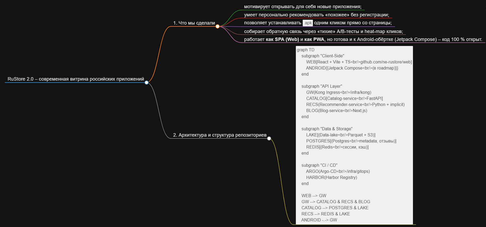

# 🐉 ne-rustore — Обновлённый RuStore (Хакатон-решение)

Добро пожаловать в репозиторий **ne-rustore**, в котором собрана полная архитектура нашего хакатонного решения — переосмысленного RuStore с новыми фичами и улучшенным дизайном.

---

## 1. 📚 Описание решения

Мы взяли идею RuStore — магазина приложений для Android — и развили её в более современный, модульный и персонализированный сервис. В нашем решении:

- **Обновлённый веб-интерфейс**: современный UI/UX для удобства пользователей и разработчиков.
- **Каталог** приложений с сервисами micro-сервисной архитектуры.
- **Система рекомендаций**, которая подбирает приложения под интересы пользователя.
- **Блог** с гайдами, новостями и обзорами приложений.
- **Инфраструктура** для CI/CD, мониторинга, развёртывания.
- **Хранилище данных (data lake)** для аналитики, логов и обработки пользовательских данных.

Таким образом, мы не просто клонировали RuStore, а предложили эволюцию: расширили функциональность, усилили аналитическую часть и сделали сервис масштабируемым.

---

## 2. 🛠 Архитектура проекта

Вот как устроено наше решение на уровне архитектуры и структуры репозиториев:

```
ne-rustore/
├── web/ — фронтенд веб-приложения (TypeScript)
├── catalog-service/ — сервис каталога приложений (Go)
├── recommender-service/ — сервис рекомендаций (Python)
├── blog/ — блог-сайт (Astro)
├── infra/ — инфраструктурный слой: конфигурации, IaC, CI/CD
└── data-lake/ — хранилище данных для аналитики (Python, ETL)
```



| Репозиторий             | Кратко                             | Технологии                              |
| ----------------------- | ---------------------------------- | --------------------------------------- |
| **web**                 | Основная витрина (SPA)             | React 18, Vite, Tailwind, framer-motion |
| **catalog-service**     | CRUD мета-данных приложений        | FastAPI, SQLAlchemy, Pydantic           |
| **recommender-service** | «Похожие», «Популярное», «Новинки» | implicit, scipy, Redis                  |
| **blog**                | Статьи и «Выбор редакции»          | Next.js, MDX                            |
| **infra**               | IaC: K8s, Helm, CI/CD              | Terraform, Argo-CD, Kong                |
| **data-lake**           | Сырые и агрегированные данные      | S3, Parquet, Jupyter-notebooks          |

---

### Компоненты и роли:

- **Web (frontend)**: пользовательский интерфейс магазина — просмотр приложений, поиск, категория, персонализованные рекомендации.
- **Catalog Service**: бекенд для хранения метаданных приложений — информация о приложении, категории, версии, описание.
- **Recommender Service**: машина рекомендаций — принимает данные о пользователе, события и предлагает приложения.
- **Blog**: контент-платформа для статей, гайдов и обзоров.
- **Infra**: инфраструктура (возможное использование Terraform/Ansible или аналогов), CI/CD пайплайны, мониторинг, логгинг.
- **Data Lake**: сбор и хранение данных — логи пользовательского поведения, телеметрия, данные для обучения модели рекомендаций и аналитики.

Архитектурно сервисы взаимодействуют через API: веб-приложение запрашивает каталог, связывается с рекомендатором, записи логируются в data lake, инфраструктура управляет развёртыванием и масштабированием.

---

## 3. 🌐 Скринкаст работы сайта

[**Скринкаст на яндекс диске**](https://disk.yandex.ru/d/G_dEMPz1FU44zg)

---

## 4. 📂 Ссылка на презентацию

[Презентация нашего решения ne-rustore](https://anecodehihstankin.my.canva.site/ne-rustore)

---

## 5. 🚀 Фишки нашего решения

Вот ключевые преимущества и уникальные фичи, которые мы реализовали:

- **Персонализированные рекомендации**: система рекомендаций анализирует поведение пользователей и предлагает приложения, которые могут их заинтересовать.
- **Модульный микросервисный подход**: разделение на отдельные сервисы упрощает масштабирование, тестирование и разработку.
- **Современный UI/UX**: чистый, удобный дизайн, ориентированный на пользователя.
- **Контент через блог**: пользователи получают не только приложения, но и полезные статьи, гайды, обзоры, что повышает вовлечённость.
- **Аналитика и data lake**: хранение телеметрии, логов и событий позволяет собирать инсайты, обучать модели, анализировать популярность приложений.
- **Инфраструктура DevOps**: автоматизация развёртывания, мониторинг, CI/CD — всё готово к продакшену и масштабированию.
- **Расширяемость**: лёгкость в добавлении новых сервисов (например, платежи, уведомления, рейтинги).
- **Безопасность и надёжность**: благодаря разделению сервисов и изоляции, возможны независимые обновления и защита критичных компонентов.

| Фича                                             | Как реализовано                                                                          |
| ------------------------------------------------ | ---------------------------------------------------------------------------------------- |
| 🔮 **Персональные рекомендации без регистрации** | Куки + вектор на 30 последних просмотров → implicit ALS                                  |
| 🏆 **Игровая механика**                          | Badge-система: «Исследователь», «Финансист» и т.д. + прогресс-бар по категориям          |
| 📲 **1-клик установка APK**                      | PackageInstaller + Intent через прокси `/installer` (разрешения запрашиваем динамически) |
| 🧪 **A/B тесты интерфейса**                      | Feature-flag в Kong → в `/infra/ab-tests` можно включить альтернативную карточку         |
| 🔥 **Heatmap кликов**                            | Анонимные координаты кликов → в data-lake → Jupyter-ноутбук для построения тепловых карт |
| 🎨 **Скелетон-загрузка**                         | Кастный `<Skeleton>` на React, а не стандартный Spinner                                  |
| 🌐 **Share-карточка VK**                         | Кнопка «Поделиться» → генерация OpenGraph-картинки на лету (canvas) → пост в VK          |
| 📰 **Блог «Выбор редакции»**                     | Отдельный сервис = можно выкатывать статьи без перезапуска всей витрины                  |
| 🧩 **Полная Type-Safety**                        | OpenAPI 3.1 → авто-генерация `client.ts` и `models.d.ts` в `/web/src/api`                |
| 🚀 **GitOps-доставка**                           | Push в main → CI (GitHub Actions) → образ в Harbor → Argo-CD → k8s (≈ 3 мин)             |

## 6. Как запустить локально

#### 1. Клонируем meta-репу

```bash
git clone https://github.com/ne-rustore/infra.git && cd infra
```

#### 2. Поднимаем весь стек (K8s + Kind)

```bash
make cluster-up
make deploy-all
```

#### 3. Запустить проект в режиме разработки:

```bash
open http://localhost:8080
```

## 7. Дальнейший роадмап

- Android-обёртка (Jetpack Compose)
- Виджет «Рекомендация дня»
- Экспорт .apks из Google Play → автоматический парсер в data-lake
- Поддержка split-APK и обновлений через UpdateManager

---

Спасибо, что ознакомились с нашим проектом! Если хотите, могу также написать `README.md` для каждого отдельного репозитория (web, catalog-service и т.д.), чтобы они были полными и самодокументированными.

---

> _“Мы не просто клонируем RuStore — мы создаём **новое поколение RuStore**, где пользователи получают персонализированный и современный опыт, а разработчики могут легко расширять и интегрировать функциональность.”_

```text
GitHub Organization: https://github.com/ne-rustore
```
